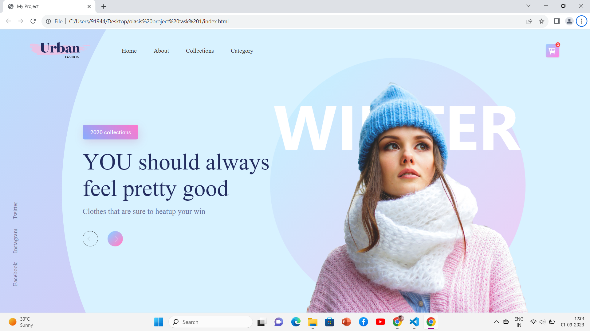

# OIBSIP
# Landing Page Project

This repository contains a simple landing page created using HTML and CSS.

## Overview

The landing page is designed to showcase [briefly describe what your landing page is about]. It includes [mention any key features or components of your landing page]. 

## Getting Started

These instructions will help you get a copy of the project up and running on your local machine for development and testing purposes.

1. **Clone the Repository**

2. **Open the Project**

Navigate to the project directory:

3. **View the Landing Page**

Open the `index.html` file in your web browser to see the landing page.

## Contributing

If you would like to contribute to this project, please follow these steps:

1. Fork the repository.
2. Create a new branch for your feature or bug fix: `git checkout -b feature-name`
3. Make your changes and commit them: `git commit -m "Add your message here"`
4. Push to your branch: `git push origin feature-name`
5. Create a pull request to merge your changes into the main branch.

## License

This project is licensed under the MIT License - see the MIT LISCENCE file for details.

